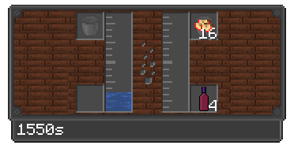

---
navigation:
  title: Fermentation Barrel
  icon: infinity_nexus_mod:fermentation_barrel
  position: 165
categories:
  - machines
item_ids:
  - infinity_nexus_mod:fermentation_barrel
---

# Fermentation Barrel

## Info
- The Fermentation Barrel is used to ferment food or refine metals.
- Although it does not accept upgrades since it is not a machine, you can &6**double** &rthe fermentation speed by placing a **mycelium block** <ItemImage id="minecraft:mycelium" /> underneath it.

<RecipeFor id="infinity_nexus_mod:fermentation_barrel" />

## Structure Visualization

<GameScene zoom="2">
  <ImportStructure src="structures/fermentation_barrel.nbt" />
</GameScene>
