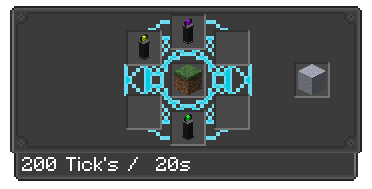

---
navigation:
  title: Infuser
  icon: infinity_nexus_mod:infuser
  position: 163
categories:
  - machines
item_ids:
  - infinity_nexus_mod:infuser
  - infinity_nexus_mod:tech_pedestal
  - infinity_nexus_mod:exploration_pedestal
  - infinity_nexus_mod:resource_pedestal
  - infinity_nexus_mod:magic_pedestal
  - infinity_nexus_mod:creativity_pedestal
  - infinity_nexus_mod:decor_pedestal
---

# Infuser

## Info
- The Compactor is a multi-block machine that occupies a 5x5 area around itself.
- Infuser has no interface, to insert items into it, you must interact with it by right-clicking.
- Created items are added to the output slot.
- Some recipes do not require all pedestals to function.
- A redstone signal can be used to silence the Infuser while keeping it functional.

## Structure Visualization

- If everything is set up correctly, the pedestals will begin the infusion process.

<GameScene zoom="4">
  <ImportStructure src="structures/infuser_altar.nbt" />
</GameScene>

## Recipe Example
- Recipe for Clay

<GameScene zoom="3" interactive={true}>
  <ImportStructure src="structures/infuser_altar_recipe.nbt" />
  <IsometricCamera  yaw="30" pitch="30" />
</GameScene>

