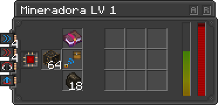

---
navigation:
  title: Miner
  icon: infinity_nexus_miner:miner
  position: 300
categories:
  - machines
item_ids:
  - infinity_nexus_miner:miner
---

# Miner

Welcome to the **Infinity Nexus Miner** guide! This miner is capable of extracting ores located beneath its structure.

Miner can extract resources from the bellow ores located inside its structure. for more information, see [Miner Level 1 Ores](miner_level_1_on.md)

## Interface
- **[A]**: This button streamlines the construction of the miner's structure. When pressed, it automatically assembles the miner's framework, provided you have the correct tier structure and the necessary components installed.
- **[R]**: This button reveals all available miner recipes corresponding to the tier components for each ore. It serves as a comprehensive guide to the miner's capabilities.

## Tiers
  - [Tier 1](miner_level_1.md)
  - [Tier 2](miner_level_2.md)
  - [Tier 3](miner_level_3.md)
  - [Tier 4](miner_level_4.md)
  - [Tier 5](miner_level_5.md)
  - [Tier 6](miner_level_6.md)
  - [Tier 7](miner_level_7.md)
  - [Tier 8](miner_level_8.md)
  - [Tier 9](miner_level_9.md)

## Upgrades

The miner can be enhanced with the following upgrades:

- **<ItemImage id="infinity_nexus_core:speed_upgrade" /> Speed Upgrade:** Increases mining speed.
- **<ItemImage id="infinity_nexus_core:strength_upgrade" /> Strength Upgrade:** Improves energy efficiency.
- **<ItemImage id="infinity_nexus_core:muffler_upgrade" /> Muffler Upgrade:** Disable mining sound.
- **<ItemImage id="infinity_nexus_core:pusher_upgrade" /> Pusher Upgrade:** Ejects items to the miner's upper inventories.
- **<ItemImage id="infinity_nexus_core:linking_tool" /> Linking Tool:** Sends items to linked inventories.

## Miner Recipe

To craft the miner, use the following recipe:

<RecipeFor id="infinity_nexus_miner:miner" />
