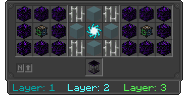

---
navigation:
  title: Compactor
  icon: infinity_nexus_mod:compactor
  position: 164
categories:
  - machines
item_ids:
  - infinity_nexus_mod:compactor
---

# Compactor

## Info
- The Compactor is a multi-block machine that occupies a 3x3 area around itself.
- To use the Compactor to create items, place the blocks above it in a 3x3x3 area, where the middle item must be a dropped item.
- The blocks must follow the order from right to left and from top to bottom for each layer. Remember to start from north to south.
- The recipe will only be completed after receiving a redstone pulse.

## Structure Visualization

- When not properly placed in a clean 3x3 area, the Compactor will appear inactive and will not function.

<GameScene zoom="4">
  <ImportStructure src="structures/compactor_layer_0.nbt" />
</GameScene>

## Recipe Example
- Recipe for Tank

## Layer 1
<GameScene zoom="3" interactive={true}>
  <ImportStructure src="structures/compactor_layer_1.nbt" />
  <IsometricCamera  yaw="30" pitch="30" />
</GameScene>

## Layer 2
<GameScene zoom="3" interactive={true}>
  <ImportStructure src="structures/compactor_layer_2.nbt" />
  <IsometricCamera  yaw="30" pitch="30" />
</GameScene>

## Layer 3
<GameScene zoom="3" interactive={true}>
  <ImportStructure src="structures/compactor_layer_3.nbt" />
  <IsometricCamera  yaw="30" pitch="30" />
</GameScene>

