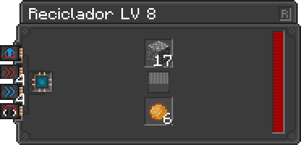

---
navigation:
  title: Recycle
  icon: infinity_nexus_mod:recycler
  position: 166
categories:
  - machines
item_ids:
  - infinity_nexus_mod:recycler
  - infinity_nexus_mod:residual_matter
---

# Recycle

## Info
- The Recycler has a single purpose, to destroy any item and hopefully transform it into Residual Matter.
- Residual Matter can be used to increase the efficiency of [Matter Condenser](matter_condenser.md).
- The chance of producing Residual Matter increases according to the machine's level, starting at 5%.

